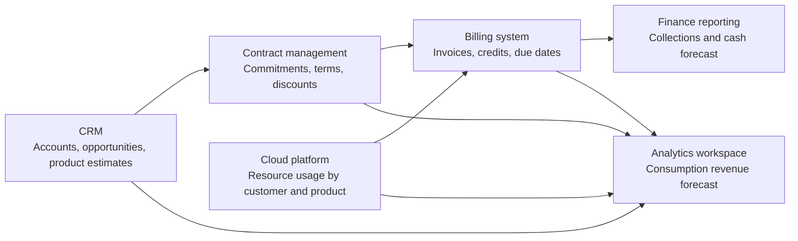

# Senior Data Analyst Home Assignment: B2B Cloud Revenue Forecast

## Context

NimbusCompute is a fictional B2B cloud infrastructure provider. The company sells compute, GPU, object storage, and network egress services to SaaS, fintech, AI, gaming, and enterprise customers.

Finance and Sales leadership need a three-month forecast for June-August 2026. They care about two related but different views:

1. **Consumption forecast**: expected customer cloud consumption, translated into monthly revenue.
2. **Payment forecast**: expected cash collections, based on invoices, payment terms, contract structures, prepaid commitments, and overdue balances.

## Data

The `data/` directory contains:

- `billing_customers.csv`: Billing-side customer metadata.
- `monthly_usage.csv`: Historical monthly usage by customer and product through May 2026.
- `price_list.csv`: Product list prices and effective dates.
- `contracts.csv`: Contract commitments, discounts, billing frequency, and payment terms.
- `invoices.csv`: Historical invoices, credits, due dates, and paid dates.
- `crm_accounts.csv`: CRM-side account records.
- `crm_opportunities.csv`: Sales pipeline opportunities for new logos, renewals, and expansions.
- `crm_opportunity_products.csv`: Product/SKU estimates inside opportunities.
- `business_events.csv`: Business context that may affect interpretation.

The data is synthetic. Treat it like an extract from real operating systems.

## System Architecture Overview

NimbusCompute's commercial and financial data comes from several operational systems:

At a high level:

- The **cloud platform** records monthly product usage for billing customers.
- The **billing system** turns usage, contracts, credits, and payment terms into invoices.
- The **CRM system** tracks sales accounts, opportunities, expected close dates, and product-level deal estimates.
- The **contract system** stores committed spend, billing frequency, discounts, and payment terms.
- Finance and Sales use these sources together to forecast consumption revenue and cash collections.

## Main Entities

### Billing Customer

A billing customer is the customer record used by the billing and usage systems. It is identified by `customer_id`.

Important fields:

- `segment`: Commercial grouping such as SMB, Commercial, Enterprise, or Strategic.
- `customer_status`: Current billing-side customer status.
- `payment_terms_days`: Default number of days between invoice date and expected payment due date.

### CRM Account

A CRM account is the sales-side account record. It is identified by `crm_account_id`.

CRM accounts are used by Sales to manage pipeline and may represent existing customers, prospective new customers, parent accounts, or account groups.

Important fields:

- `matched_customer_id`: Billing customer identifier when a CRM account is linked to a billing customer.
- `match_confidence`: Qualitative confidence level for the CRM-to-billing account link.
- `account_owner`: Sales owner responsible for the account.

### Product Usage

Product usage is the monthly consumption recorded by the cloud platform. Usage is stored by `month`, `customer_id`, and `product`.

Product families in this assignment include:

- `compute_standard`: General compute usage measured in compute hours.
- `gpu_a100`: Legacy GPU usage measured in GPU hours.
- `gpu_accelerated`: Current GPU usage measured in GPU hours.
- `object_storage`: Average stored TB during the month.
- `network_egress`: Public network egress in TB.

### Price List

The price list contains list prices by product and effective date. Prices can change over time.

Important fields:

- `product`: Product or SKU name.
- `effective_from`: First date when the price applies.
- `unit`: Unit of measure for the list price.
- `list_price_usd`: List price in USD for the unit.

### Contract

A contract defines commercial terms for a billing customer. It is identified by `contract_id`.

Important fields:

- `committed_spend_usd`: Contracted customer commitment over the contract term.
- `billing_frequency`: How the contract is billed, such as monthly arrears, quarterly prepay, annual prepay, or commit drawdown.
- `discount_pct`: Discount applied to list-price consumption.
- `contract_status`: Current contract state.

### Invoice

An invoice is a billing-system record for usage, credits, prepayments, or other customer charges. It is identified by `invoice_id`.

Important fields:

- `invoice_date`: Date when the invoice was issued.
- `service_month`: Month when the underlying service was consumed or credited.
- `invoice_type`: Type of invoice line, such as usage, prepayment, credit, or correction.
- `amount_usd`: Invoice amount in USD.
- `due_date`: Expected payment due date.
- `paid_date`: Actual payment date when available.
- `payment_status`: Current payment state.

### CRM Opportunity

A CRM opportunity represents a potential commercial event such as a new logo, expansion, renewal, or product-specific deal. It is identified by `opportunity_id`.

Important fields:

- `stage`: Current sales stage.
- `forecast_category`: Sales forecast category.
- `probability`: Sales-provided close probability.
- `expected_close_date`: Expected signing or close date.
- `expected_start_month`: Month when consumption or billing is expected to start.
- `total_contract_value_usd`: Expected total deal value over the term.
- `expected_committed_spend_usd`: Expected committed spend portion.
- `expected_monthly_consumption_usd`: Sales estimate of expected monthly consumption.
- `payment_structure`: Expected payment or billing structure.

### CRM Opportunity Product

Opportunity product rows describe the product or SKU mix inside a CRM opportunity.

Important fields:

- `crm_sku`: Sales-side SKU or package name.
- `product_family`: Product family associated with the SKU estimate.
- `estimated_monthly_usage`: Sales estimate of monthly usage volume.
- `estimated_monthly_revenue_usd`: Sales estimate of monthly revenue for the product row.
- `ramp_month`: Expected month of the ramp within the opportunity timeline.
- `confidence`: Sales confidence in the product estimate.

### Business Event

A business event provides dated context that may be relevant to historical interpretation or forecasting.

Examples include pricing changes, product migrations, capacity constraints, billing-system changes, and sales-policy changes.

## Forecast Concepts

### Consumption Revenue

Consumption revenue reflects the value of cloud resources consumed in a service month. It is usually connected to product usage, list prices, discounts, and expected pipeline usage.

### Cash Collections

Cash collections reflect when money is expected to be received. Collections depend on invoice dates, due dates, paid dates, customer payment behavior, and contract payment structures.

### Pipeline Contribution

Pipeline contribution reflects expected future consumption or cash from CRM opportunities. Pipeline data can affect both consumption and payment forecasts, depending on expected close timing, start timing, ramp, probability, contract term, and payment structure.

## Task

Prepare a forecast and executive recommendation for Finance and Sales leadership.

Your forecast should cover June, July, and August 2026 and should include:

1. **Consumption revenue forecast**

2. **Payment / cash collections forecast**

3. **Scenario view**

4. **Data review**

5. **Executive summary**

## Expected Deliverables

Please submit:

- SQL queries used for the analysis. We prefer SQL as the primary analytical tool where practical.
- A reproducible notebook or scripts in Python if used.
- A forecast output CSV with monthly consumption revenue and cash collections by scenario.
- A short written memo or slide-style summary for leadership.
- Any additional charts or tables you think are useful.

## Timebox

Suggested timebox: 3-4 hours.
